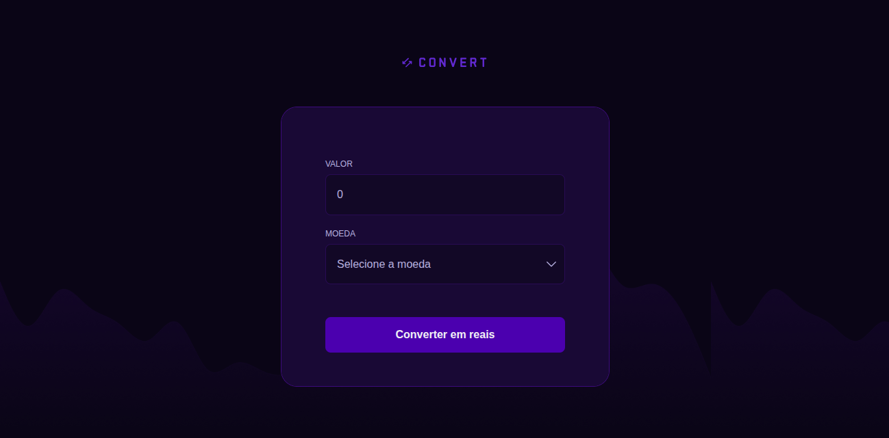

<h1>Convert 🔄</h1> 

Um conversor de moedas simples para calcular o valor em reais, desenvolvido para treinar JavaScript no curso Fullstack da Rocketseat.
 
 

<h2>Descrição</h2> 

O projeto <strong>Convert</strong> foi desenvolvido como parte dos estudos do curso Fullstack da Rocketseat. O principal objetivo foi praticar lógica de programação e manipulação do DOM com JavaScript, criando um conversor de moedas interativo.
 

O layout foi elaborado no Figma pela equipe da Rocketseat e a implementação foi feita com HTML5, CSS3 e JavaScript. Além da conversão de moedas, o projeto também aborda o uso de expressões regulares e eventos de formulário.
 

<h2>Tecnologias</h2>

 
  
<small>Thank you for reading! ❤️</small>
